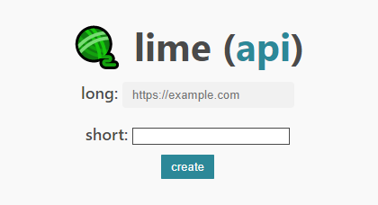

<a href="https://github.com/fuwn/lime">
<h1 align="center">🧶 lime</h1>
</a>

no bs url shortening

## nix
- build: `nix-build`
- docker: `nix-build docker.nix`

## usage (without docker)
- run (dev): `cargo run`

## development dependencies
### required
- [diesel_cli](https://crates.io/crates/diesel_cli)
- [cargo-make](https://github.com/sagiegurari/cargo-make)

### optional
- [cargo-watch](https://crates.io/crates/cargo-watch)

*these development dependencies will automatically be satisfied if you are using the nix
shell configuration as provided.*

### license
[gnu general public license v3.0](./license)
